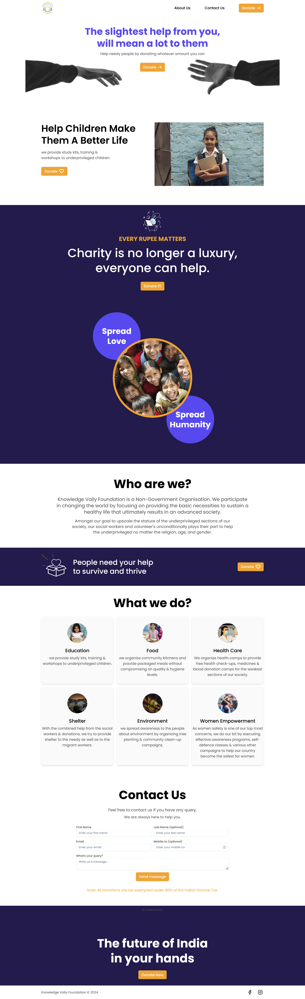
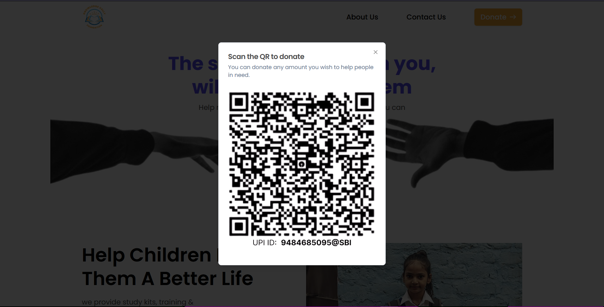
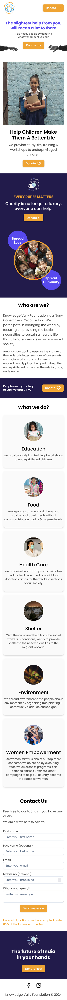

# Knowledge Vally Foundation Website

This is a Marketing site for a Non-Government Organisation called Knowledge Vally Foundation.

## Table of contents

- [Knowledge Vally Foundation Website](#knowledge-vally-foundation-website)
  - [Table of contents](#table-of-contents)
  - [Overview](#overview)
    - [The challenge](#the-challenge)
    - [Links](#links)
  - [My process](#my-process)
    - [Built with](#built-with)
    - [Challenges I faced](#challenges-i-faced)
    - [Useful resources](#useful-resources)
  - [Author](#author)
  - [Screenshots](#screenshots)

## Overview

### The challenge

Users should be able to:

- Visit the website and get to know about the organisation
- Donate money by scanning the QR code
- Contact the org members by filling out the form on website

### Links

- Solution URL: [GitHub](https://github.com/ChaudharyPradip/kvfwebsite)
- Live Site URL: [Knowledge Vally Foundation](https://kvfgov.com)

## My process

### Built with

- [Next.js](https://nextjs.org/) - The React framework for the web
- [Tailwind](https://tailwindcss.com/) - CSS framework
- [Shadcn UI](https://ui.shadcn.com/) - UI framework for react
- [Netlify Forms](https://www.netlify.com/platform/core/forms/) - For handling form submissions on website
- [Figma](https://www.figma.com/) - For designing the website UI
- Mobile-first workflow
- Semantic HTML5 markup
- Flexbox
- Grid

### Challenges I faced

- How to handle call-back from form submission using Netlify Forms
  I used client component to conditionally render if it's netlify call-back

### Useful resources

- [Next.js Docs](https://nextjs.org/docs) - These helped me in understanding some of the powerful features that Next.js offers like Image optimisation and many more.
- [Tailwind CSS Docs](https://tailwindcss.com/docs/) - It is very helpful to quickly find out tailwind equivalents of CSS properties.

## Author

- Frontend Mentor - [@ChaudharyPradip](https://www.frontendmentor.io/profile/ChaudharyPradip)
- Twitter - [@thePradiptalks](https://www.twitter.com/thePradiptalks)

## Screenshots

Desktop view of Website

QR for donations

Success message on form submission

Mobile view of website
